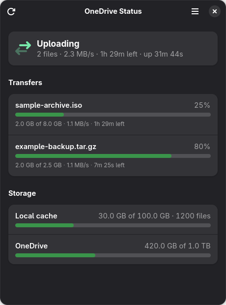

# OneDrive Status

A GNOME status app for an rclone OneDrive mount — a tray indicator plus a
GTK4 window showing what is uploading, how full the local cache is, and how
much OneDrive space is left.



## What it actually reports

This targets OneDrive mounted with `rclone mount --vfs-cache-mode=full`,
which is **not** a two-way sync client. Files are
fetched on demand and local writes queue in a write-back cache that uploads in
the background. There is no "percent of a mirrored folder synced" to show.

What matters instead, and what this app displays:

| Signal | Source |
|---|---|
| Files currently uploading, with progress, speed and ETA | `core/stats` |
| Uploads in progress and queued, cache errors | `vfs/stats` |
| Local cache usage against `--vfs-cache-max-size` | `vfs/stats` |
| OneDrive space used and total | `operations/about` |
| Mount health and uptime | `systemctl --user` + `os.path.ismount` |

Health resolves to one of four states:

- **ok** — unit active, mount present, no errors
- **error** — transfer errors, cache errors, or the cache is out of space
- **degraded** — mounted and running, but the rc API is unreachable
- **down** — the unit is dead, *or* the FUSE mount vanished while the unit
  still reports active (this happens, and it is just as unusable)

## Install

```bash
./install.sh            # app launcher + tray autostart
./install.sh --no-tray  # window only
```

This adds a launcher to the app grid and an autostart entry for the tray. It
also enables the `appindicatorsupport` GNOME extension if it is installed but
off — without it GNOME provides no `StatusNotifierWatcher`, and the tray icon
silently never appears.

Start things without logging out:

```bash
./bin/onedrive-status         # window
./bin/onedrive-status-tray &  # tray
```

Uninstall: delete `~/.local/share/applications/dev.matheoatche.OneDriveStatus.desktop`
and `~/.config/autostart/onedrive-status-tray.desktop`.

## Layout

    odstatus/probe.py   data layer: rc API + systemd -> Snapshot. No GUI imports.
    odstatus/window.py  GTK4 + libadwaita window.
    odstatus/tray.py    GTK3 + AppIndicator3 tray daemon.

**Why two processes.** `AppIndicator3` links against GTK3, and one Python
process cannot load GTK 3 and GTK 4 together — importing both raises
`ImportError: Requiring namespace 'Gtk' version '3.0', but '4.0' is already
loaded`. The tray therefore launches the window as a subprocess. Both import
`probe.py`, and either runs standalone.

**Polling.** Transfer and cache stats poll every 2s; they are loopback calls
and effectively free. `operations/about` is a live request to Microsoft, so it
is cached for 60s to stay clear of API rate limits. That split is the main
reason the data layer is its own module.

**Failure handling.** A failed poll never raises — it returns a `Snapshot`
describing the failure, because "the mount is down" is the state most worth
displaying correctly.

## Configuration

Environment variables, all with working defaults:

| Variable | Default |
|---|---|
| `ODSTATUS_RC_ADDR` | `127.0.0.1:5572` |
| `ODSTATUS_UNIT` | `rclone-onedrive.service` |
| `ODSTATUS_MOUNT` | `~/OneDrive` |
| `ODSTATUS_REMOTE` | `onedrive:` |

The mount must run with `--rc --rc-addr=127.0.0.1:5572 --rc-no-auth`. A
matching systemd user unit is included at `data/rclone-onedrive.service.example`.

## Tests

```bash
python3 -m venv --system-site-packages .venv && .venv/bin/pip install pytest
.venv/bin/python -m pytest tests/ -q
```

`probe.py` is a pure function over JSON, tested against synthetic fixtures
shaped like real rc API responses mid-upload. The launcher tests start both
entry points from several working directories and through a symlink.
`--system-site-packages` lets the venv see the system PyGObject; the app
itself needs no venv and no third-party packages.

## Requirements

No third-party Python packages. On Fedora: `python3-gobject`, `gtk4`,
`libadwaita`, and `libappindicator-gtk3` (for the `AppIndicator3` typelib),
plus the AppIndicator GNOME extension for the tray. Adjust package names for
other distributions.

Screenshots and test fixtures use synthetic data, not real account contents.

## Licence

MIT — see [LICENSE](LICENSE).
